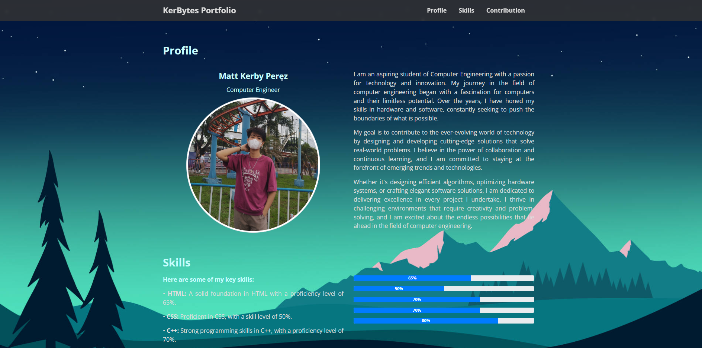
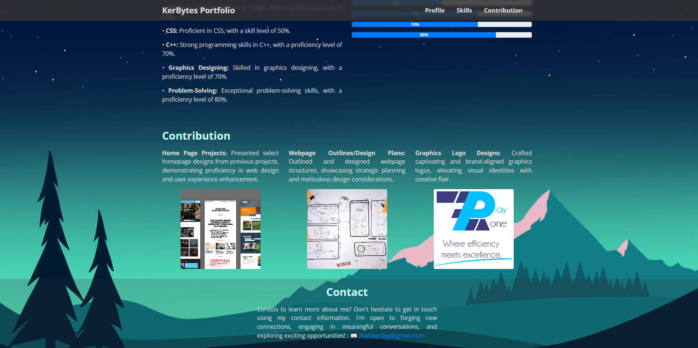

# 📝 My Portfolio 

Welcome to my first GitHub repository and my first ever simple coding project!

## About

This project is a personal portfolio website built with **HTML** and **CSS**. It serves as a showcase of my journey as I begin learning web development and version control with **GitHub**. 

I created this project using **PyCharm**, which helped me organize my files and learn basic coding workflows.

## Preview

Below are two screenshots of the site preview. You can view them here or on GitHub by navigating to the `Portfolio/images/assets-preview` folder.





## Features

- Clean and simple design
- Responsive layout (basic)
- Easy-to-edit HTML and CSS structure
- An introduction to me and my interests

## Getting Started

**To view the project:**

1. Clone the repository:

    ```bash
    git clone https://github.com/mattkerbyy/My-Portfolio.git
    ```

2. Open the project folder with your preferred code editor.
3. In your terminal, run `python manage.py runserver` to start the development server and view the site in your browser.

## Why I Made This

I wanted to start my coding journey with something simple yet meaningful. By building a personal portfolio, I learned the basics of HTML and CSS, and how to use GitHub for sharing and version control.

> **This project is especially sentimental to me, as it represents my very first steps into the world of coding and serves as a personal milestone. Every detail reflects my own preferences and growth.**

---

Thank you for checking out my first project!
